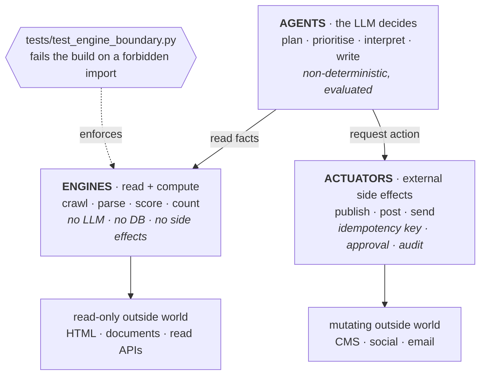
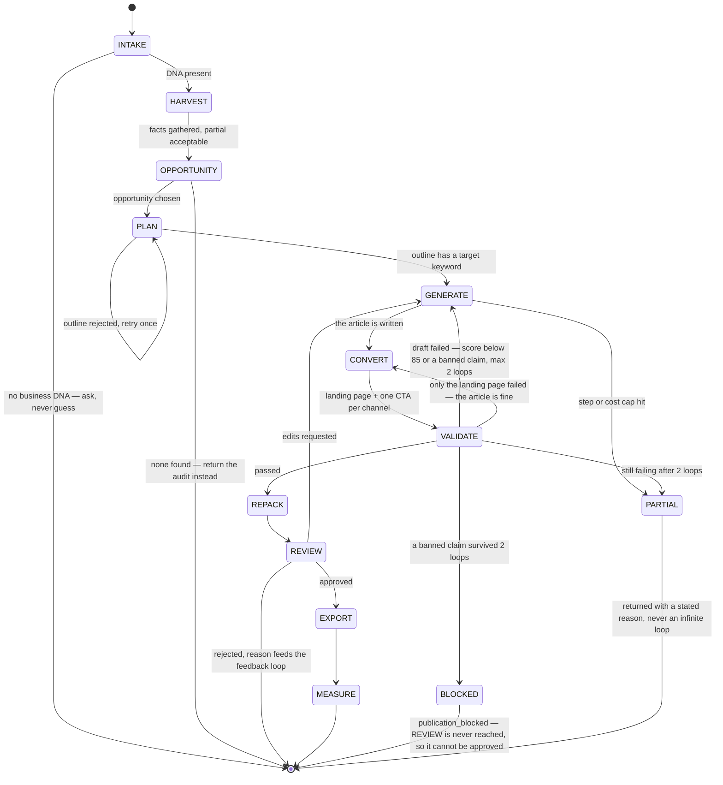
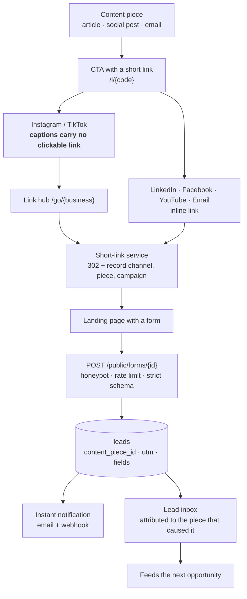

# Social Marketing Agent

An AI growth agent for small businesses. Give it a website and any documents the
business has, and it produces the content and instrumentation that earns
visibility on **Google**, in **AI answer engines**, and on **social media** — with
a lead-capture and attribution loop, so the output is measured in leads rather
than in vibes.

**Status: the loop runs end to end.** Phases 0–13 are complete — the graph executes,
runs are resumable and reviewable, the knowledge base ingests the business's own
documents and is read while the agent works, leads are captured and attributed, and
the whole thing is tenant-isolated behind row-level security. What is **not** done is
listed honestly in [BACKLOG.md](BACKLOG.md), including the parts that need a credential
somebody has to supply.

Read [PROBLEM.md](PROBLEM.md) first if you want the *why* before the *what*.

---

## Why this exists

A small business owner knows they need content marketing but has neither the SEO
expertise nor the time. The alternatives are a €500–850/month tool stack they
must operate themselves, or a €2,000–5,000/month agency. Generic ChatGPT output
is off-brand, ignores search intent, and still has to be reformatted for every
channel by hand.

Existing "AI SEO" products sell **reach** — "30 articles a month". A business that
publishes 30 articles with no call to action, no form, and no attribution gets
traffic and no leads, then cancels. This project owns the whole chain:

```
REACH → RELEVANCE → CONVERSION → ATTRIBUTION → COMPOUNDING
```

**Users:** SMB owners without a marketing team (primary), solo in-house
marketers, and small agencies running several clients.

## Documentation

The architecture, the run, and the attribution loop are **drawn inline below** — you do not
have to open anything to see how this works. These are for going deeper.

| Document | What it answers |
|---|---|
| [docs/ROADMAP.md](docs/ROADMAP.md) | Strategy, scope, honest constraints |
| [docs/FEATURES.md](docs/FEATURES.md) | Every feature, and how each one produces a lead |
| [docs/ARCHITECTURE.md](docs/ARCHITECTURE.md) | Technical design; architecture → business benefit |
| [docs/DIAGRAMS.md](docs/DIAGRAMS.md) | All 14 diagrams. The three that matter most are inline below — context, request flow, tool loop, agentic RAG, model routing, data model and deployment are there |
| [docs/AGENT_RUNTIME.md](docs/AGENT_RUNTIME.md) | How the agents work: state, nodes, tool loop, prompts, memory, caps |
| [docs/BUILD_ORDER.md](docs/BUILD_ORDER.md) | **The execution plan — build from this** |
| [docs/CHANNELS.md](docs/CHANNELS.md) | What we can actually publish, and per-platform content |
| [docs/FREE_CHANNELS.md](docs/FREE_CHANNELS.md) | Free presence and citations; why Wikipedia is excluded |
| [docs/CRITERIA_MAP.md](docs/CRITERIA_MAP.md) | Evidence map, agent concepts, claims discipline |
| [PROBLEM.md](PROBLEM.md) | The problem, the users, and why an agent rather than a script |
| [BACKLOG.md](BACKLOG.md) | **What is done and what is open** — including the weaknesses this project's own tooling found |

## Quickstart

Requires Python 3.13, Node 22, Docker, and [uv](https://docs.astral.sh/uv/).

```bash
cp .env.example .env
make install          # uv sync + pnpm install
make up               # postgres :5435, redis :6381
make api              # terminal 1 — FastAPI on :8100
make web              # terminal 2 — Next.js on :3100
```

Open http://localhost:3100 and walk it in this order — it is the customer journey,
and each step is a thing the agent will use:

1. **Sign up.** One account owns one business, created in the same transaction.
2. **`/onboard`** — paste a website URL. It is crawled and read into a draft Business
   DNA that you confirm or correct; confirming is what stores it, and `banned_claims`
   from that profile is what the regulated-claim gate later enforces.
3. **`/documents`** — upload a price list or service sheet (pdf, docx, md, txt, html).
   The screen reports what indexing ACHIEVED, not that the upload worked: a scanned PDF
   yields no text, and it says so rather than implying the file is searchable. The
   passage count at the top is what the agent can actually quote.
4. **`/memory`** — add a preference. It is carried into every run from then on, and the
   panel shows the exact lines the next run's prompt will receive.
5. **`/connections`** — the platform accounts a publish step would use. Worth opening
   before your first run, because it is the screen that tells you what publishing can
   honestly do here: which accounts are connected, whether a publish would actually be
   ACCEPTED (derived server-side, never recomputed in the browser), and which platforms
   are waiting on their own App Review. It also states two things plainly rather than
   letting you find them by clicking — that no credential can be stored until
   `PLATFORM_CREDENTIAL_KEY` is set, and that with only the fake provider configured an
   authorisation cannot complete at all, because its address is a reserved domain that
   can never resolve.
6. **Start a run from the dashboard**, then watch `/runs/{id}`: the timeline names every
   node, what each one cost, and any source that failed. Open the review tabs for the
   draft, the deterministic SEO findings, the per-channel posts and the AI answer blocks.
7. **`/leads`** — a captured lead, named against the content piece that earned it.

**With no model key in `.env` everything still runs**, on deterministic fake providers,
and every surface says so — the run timeline names the fake, the review screen lists
what the work was written *without*. That is the point: nothing here reports synthetic
output as a real measurement. A run on the fake provider ends `partial`, because the
canned text genuinely does not pass the SEO gate.

`/developer` is the operator side, behind a platform-admin role: the model picker and
provider toggles, per-node tool kill switches, sampling bounds, and a cost dashboard
built on real `model_usage` rows.

```bash
make check            # lint + types + tests — exactly what CI runs
make images           # build both Docker images
make ragas-env        # build .venv-ragas, only needed for `evals/run.py --ragas`
```

### Driving the whole flow in one command

Clicking through the journey above is the way to *see* the product. `scripts/smoke.sh` is
the way to *check* it: it drives every stage through the HTTP surface and exits non-zero
on the first unexpected status, so it works by hand and in CI.

```bash
./scripts/smoke.sh
```

Ten stages — signup (which creates the user, the business and its slug in one
transaction), the CSRF guard, the body limit in front of argon2, the link hub on both
address forms, **a run executing the graph end to end**, a resume that refuses what it
should, tenant isolation, memory and leads, and the platform-admin gate. It prints a
working email and password at the end, so the fastest way to a populated UI is to run it
and sign in with what it gives you.

Two things worth knowing before the first run.

**It spends money if you have a key.** A model key in `.env` means a run makes real
calls. To exercise the same flow for free, start a second API with the keys unset — a
missing credential means the fake provider, by design — and point the script at it:

```bash
OPENROUTER_API_KEY="" ANTHROPIC_API_KEY="" uv run uvicorn backend.app.asgi:app --port 8101
```

```bash
API=http://127.0.0.1:8101 ./scripts/smoke.sh
```

**On fake providers a run ends `partial`, and stops before REVIEW.** The canned text
genuinely does not pass the SEO gate, so the revision loop runs its bounded two retries
and then says so — correct behaviour, and the reason the timeline reports a score rather
than a success. The consequence for testing: **approve → EXPORT → MEASURE is not
reachable on fake providers**, because nothing gets past the gate to approve. Seeing the
publishing half needs either a real model key or a test that drives EXPORT directly
(`backend/tests/db/test_landing_actuator.py` does exactly that, on real SQL).

`/developer` is platform-admin only, so an ordinary owner is correctly refused it. Grant
yourself the role when you need those screens:

```bash
uv run python scripts/grant_platform_admin.py --email you@example.com
```

`--revoke` puts it back, and `--list` says who has it.

### Publishing, and what it honestly does

The graph stops at a human gate. `POST /api/v1/runs/{id}/approve` is what lets it past —
EXPORT and MEASURE sit *after* REVIEW in the machine and are unreachable without it, so
"nothing publishes without a person" is structural rather than a convention.

What happens then depends on the destination, and the product says which:

| Destination | Today |
|---|---|
| **Export pack** (every channel) | Real. `GET /api/v1/runs/{id}/export` as JSON or markdown, plus a screen — text to paste, which works on channels no API can reach |
| **Email** | Real the moment `RESEND_API_KEY` is set. Refuses a send with no unsubscribe link in the body, no sender identity, or no recorded consent basis |
| **Social** (LinkedIn, Facebook, Instagram, TikTok, …) | Refuses with *"no connection — connect the account first"*, and `/connections` is where you would connect one. Two honest caveats it states itself: direct publishing needs per-platform App Review — weeks of someone else's process, not code — and with only the fake provider configured an authorisation cannot complete, because its address is a reserved domain. The routes and the screen are real; the provider behind them is not yet |
| **Landing page** | **Real, and the only destination that needs no credential** — this app serves the page. EXPORT writes a published `content_pieces` row and mints one tracked short link per channel CTA, so a run leaves something a visitor can open and a lead can be attributed to |

**A simulated send is never rendered as a real one.** With no credential an actuator
returns a real outcome marked `fake`, with a `fake://…` reference, and that flag travels
to the ledger, the timeline and the Delivery tab. The landing page is what makes that
flag worth carrying: one run now holds a REAL published page beside a SIMULATED social
post, so a surface that rendered the two alike would be visibly wrong rather than
theoretically wrong. Attribution does not depend on any of
it: the tracked short link works whether we posted or you pasted, which is the whole
reason the lead loop is decoupled from publishing.

### Evaluating it

`uv run python evals/run.py` writes [`evals/report.md`](evals/report.md) from 20 cases
across two arms (retrieval off vs on) plus a reference-answer control. Five scorers are
deterministic — SEO, brand, format, grounding, coverage — and they are what gate a
draft, because arithmetic cannot hallucinate a pass.

Two optional LLM-judged arms close the one hole arithmetic cannot see: a sentence can
cite a real chunk and then misdescribe it in words.

| flag | judge | runs |
|---|---|---|
| `--deepeval` | DeepEval | in-process, judge routed through our own `ModelRouter` |
| `--ragas` | Ragas | out-of-process in `.venv-ragas` — `ragas` caps `openai<3` and we pin `openai>=3.2`, so it cannot share this venv |

Both are off by default, so CI stays hermetic. Running both is the interesting case:
where two judges disagree on the same text, that gap measures the judges. `--live`
spends real money and refuses to start if the router resolved to the fake provider — a
report produced on canned responses under a live banner is worse than no report.

## Architecture in one rule

> **If the answer is computable, compute it. Only ask a model to decide,
> interpret, or write.**

Three component kinds, and the separation is enforced by a test rather than by
convention:

| | Does | Determinism |
|---|---|---|
| **Engines** | crawl, parse, score, count, read APIs | total — no LLM, no DB, no side effects |
| **Actuators** | publish, post, send — anything with an external effect | total, given the idempotency key |
| **Agents** | plan, prioritise, interpret, write | none — bounded and evaluated |

`tests/test_engine_boundary.py` walks the AST of every module under
`backend/app/engines/` and fails the build on a forbidden import. The rule was
installed before the first engine existed, so it can never need retrofitting.



Agents can *request* an action and never perform one. If that boundary rots, every
guarantee built on top of it silently stops being true — which is why it is a test and
not a paragraph.

## The run, drawn

Eleven nodes, and every exit is deliberate and named. There is no path that loops
forever and no path that fails silently — the two ways an autonomous system usually
burns money.



**`EXPORT` and `MEASURE` sit after `REVIEW`, and are unreachable without it.** That is
what makes "nothing publishes without a person" a property of the machine rather than a
promise in a README. `BLOCKED` never reaches `REVIEW` at all, so a surviving banned claim
cannot be approved by someone clicking through.

Worth knowing before you run it: on fake providers the canned text genuinely does not
pass the SEO gate, so a run ends `PARTIAL` after its two revision loops and reports the
score. That is the diagram working, not a failure.

## How a lead gets attributed

The part that makes this measurable in leads rather than in vibes:



**Attribution is decoupled from publishing.** The short-link service is ours, so a
channel we cannot post to is still fully measurable — which is what makes an export-only
channel worth having.

## Layout

```
backend/                     everything Python
├─ app/
│  ├─ asgi.py                process entry point — the ONLY place that loads .env
│  ├─ main.py                app factory (no import-time side effects)
│  ├─ api/                   FastAPI routes (thin)
│  ├─ agents/                the graph: state, both drivers, nodes, tool allowlist
│  ├─ core/                  config, security
│  ├─ db/                    models, migrations, adapters
│  ├─ engines/               deterministic computation — guarded by a test
│  ├─ llm/                   model router, providers, pricing
│  └─ services/              impure orchestration over engines + router
└─ tests/                    pytest; every external call faked, no network in CI

frontend/                    Next.js 16 · React 19 · Tailwind 4
docs/                        ROADMAP · FEATURES · ARCHITECTURE · DIAGRAMS ·
                             AGENT_RUNTIME · BUILD_ORDER · CHANNELS ·
                             FREE_CHANNELS · CRITERIA_MAP
```

### Why anything is at the repo root

Everything at root is there because a tool requires it, not by accident. Moving these
costs a flag on every command and buys nothing:

| File | Why it cannot move |
|---|---|
| `pyproject.toml`, `uv.lock` | `uv` resolves the project from the root |
| `.gitignore`, `.dockerignore` | git and docker only read them at the root |
| `Makefile` | the entry point people actually type |
| `README.md` | rendered by the forge |
| `BACKLOG.md` | the work queue; `/next` reads it |
| `docker-compose.yml` | conventional; moving it means `-f path` on every command |
| `alembic.ini` | conventional; moving it means `-c path` on every command |
| `.env` | dotenv's default location, and the backend's secrets live here |

### Two env files, and the split is a security boundary

| File | Read by | Holds |
|---|---|---|
| `.env` (root) | backend, via `asgi.py` | **all secrets** — model keys, database URL, session secret |
| `frontend/.env.local` | Next.js | **only** `NEXT_PUBLIC_API_URL` |

Next.js does not read the root `.env`, and that is deliberate: anything named
`NEXT_PUBLIC_*` is compiled into the browser bundle and shipped to every visitor. A
model key placed there would be a published key.

## Technical decisions

| Decision | Why | Rejected |
|---|---|---|
| **LangGraph** `StateGraph` | resumable, bounded steps, a human interrupt at a defined point, per-node evaluation. Run checkpoints stay in our own `runs.checkpoint` column rather than a LangGraph checkpointer — one source of truth for "where is this run". The hand-written driver it replaced is still selectable by `agent_runtime`, and the test suite runs every branch against both | unbounded ReAct loop; a second durable checkpoint store |
| **OpenRouter** + a second direct adapter | one integration for many models; the abstraction is proven by two implementations, not asserted | per-provider SDK sprawl |
| **Postgres + pgvector** | app data and RAG in one store to operate and back up | a separate vector database |
| **Deterministic SEO scoring** | counting is not a language task; it must be testable and free | an LLM judging SEO |
| **Probe-based AI visibility** | no citation API exists; probing is measurable today | waiting for a vendor API |
| **Next.js** | production UX and real front-end work | Streamlit / Gradio |
| **pnpm pinned via `packageManager`** | host, CI and Docker must apply the same supply-chain policy | unpinned `corepack enable` |
| **`nodeLinker: hoisted`** | Next `standalone` tracing cannot follow pnpm store symlinks | patching the standalone output |

Full reasoning, including alternatives, is in
[docs/ARCHITECTURE.md](docs/ARCHITECTURE.md) §14.

## Deploying behind a proxy

**`FORWARDED_ALLOW_IPS` must name your reverse proxy.** This is a requirement, not a
tuning knob, and getting it wrong fails silently.

The rate limiter and every abuse control key on the client's address. Behind a proxy
the socket peer *is* the proxy, so the client address has to come from
`X-Forwarded-For`. uvicorn only trusts that header from an address in
`--forwarded-allow-ips`, which defaults to `FORWARDED_ALLOW_IPS` in the environment
or `127.0.0.1`.

That default is right for a proxy sharing the container's network namespace and wrong
for the usual setup, where the proxy is its own service with its own address. In that
case the header arrives, is discarded, and **every client on the internet shares one
rate-limit bucket** — so the first abusive caller locks out everybody. Nothing errors.
The limiter works; it works against the wrong subject.

```bash
# the proxy's address, as this container sees it
FORWARDED_ALLOW_IPS=172.18.0.5
```

**Do not set it to `*`.** That is the fix that looks easiest and is worse than the
bug: trusting a forwarded header from any source lets a client claim any address, so
the limit is not shared, it is *evaded* — by varying one header per request.

`--proxy-headers` is deliberately **not** in the Dockerfile `CMD`: uvicorn 0.52
already defaults it on, and passing it would suggest it was the missing piece.
`backend/app/core/proxy_trust.py` detects both misconfigurations at runtime and logs
what to change.

## Honest limits

- Deterministic SEO scoring gates drafts; it does not predict rankings.
- AI share-of-voice is a **sample**, not a census — model answers are
  non-deterministic and shift with model updates.
- Lead attribution is last-click via UTM, so multi-touch journeys are undercounted.
- Google movement takes 6–12 weeks; the product reports leading indicators, and
  never promises traffic.
- Content velocity is capped by design. This will not mass-produce, and shouldn't.
