# Diagrams — the system, drawn

Every diagram in one place, in Mermaid so it renders on GitHub and stays
diffable. Design rationale lives in [ARCHITECTURE.md](ARCHITECTURE.md); the
agent internals are in [AGENT_RUNTIME.md](AGENT_RUNTIME.md).

Each diagram has a **"what to notice"** line, because a diagram nobody can read
a conclusion from is decoration.

---

## 1. System context

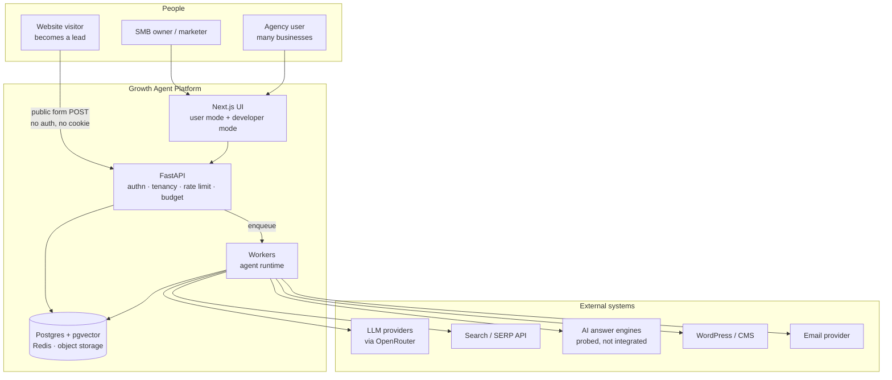

**What to notice:** the lead visitor enters through a *different, unauthenticated
door* than the customer. That public form is the only route into the system that
carries no session, which is why it gets its own rate limit and its own minimal
frontend bundle.

---

## 2. The three component kinds

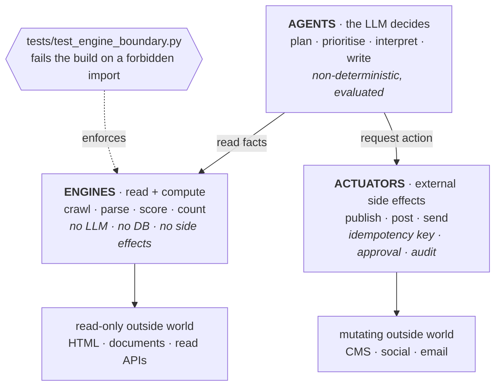

**What to notice:** agents can *request* an action but never perform one. The
boundary is enforced by a test, not a convention — if it rots, every guarantee
built on top of it silently stops being true.

---

## 3. Complete request flow — a content run

The main path through the system, end to end.

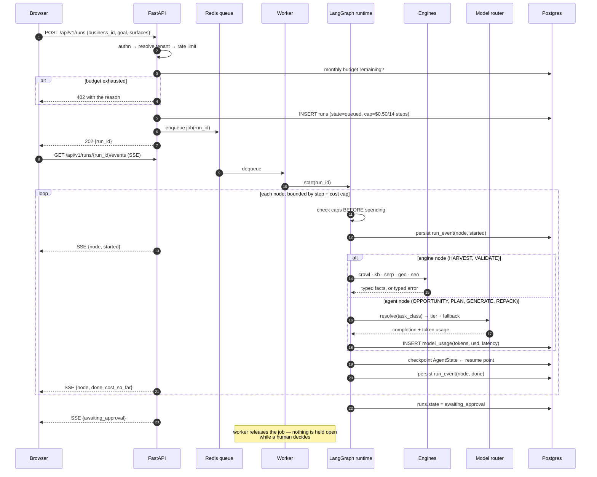

**What to notice:** three things. The HTTP request returns in step 7, long before
the work is done — nothing long-running happens inside a request. Every SSE event
is *also written to Postgres*, so a browser reload replays the timeline instead of
showing an empty screen. And the worker is released at the approval point, so a
human taking two days costs no compute.

---

## 4. The agent state machine

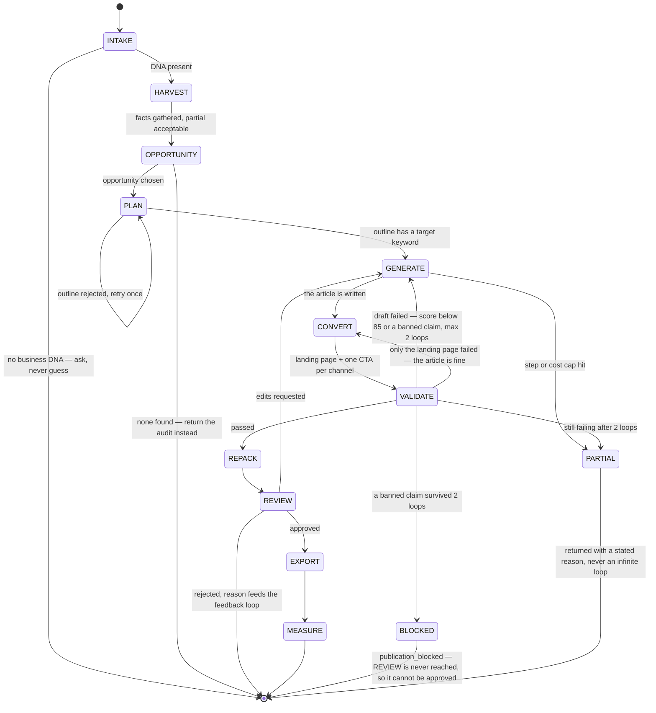

**What to notice:** every exit is deliberate and named. There is no path that
loops forever and no path that fails silently — the two ways an autonomous system
usually burns money.

---

## 5. Inside one agent node — the tool-calling loop

This is the mechanism behind "function calling", drawn exactly as implemented.

```mermaid
flowchart TB
    start(["Node begins"]) --> ctx["Build context<br/>Business DNA + memory + prior facts"]
    ctx --> filter["Tool list = node allowlist ∩ business-enabled toggles"]
    filter --> call["Model call via router"]
    call --> kind{"Response"}

    kind -->|"tool_call"| valid{"Arguments valid against<br/>the Pydantic JSON schema?"}
    valid -->|"no"| repair["ONE repair turn,<br/>carrying the validation error verbatim"]
    repair --> valid2{"valid now?"}
    valid2 -->|"no"| skip["Skip the tool<br/>record in errors[]<br/>UI says which data is missing"]
    valid2 -->|"yes"| exec
    valid -->|"yes"| exec["Execute: timeout · traced · costed"]

    exec --> obs["Append result as a tool message"]
    skip --> obs
    obs --> caps{"step cap or<br/>budget exceeded?"}
    caps -->|"no"| call
    caps -->|"yes"| partial["Return partial output<br/>with a stated reason"]

    kind -->|"final answer"| shape["Validate against the node's output schema"]
    shape --> done(["Checkpoint · node ends"])
    partial --> done
```

**What to notice:** validation happens **before** execution, so a tool never sees
malformed input. And a failed tool degrades the run rather than ending it — the
node continues with less evidence and says so.

---

## 6. Agentic RAG — why it is agentic, not a retriever

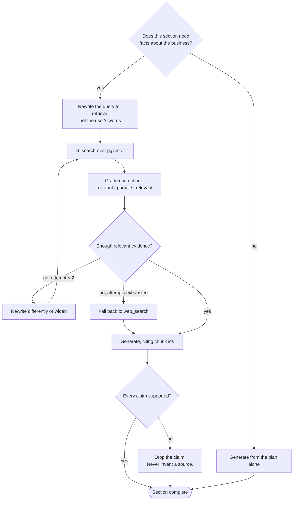

**What to notice:** four decisions a plain retriever cannot make — *whether* to
retrieve, *what* to ask, *whether the result is good enough*, and *what to do when
it isn't*. That loop is the whole difference.

---

## 7. Model routing and the budget guard

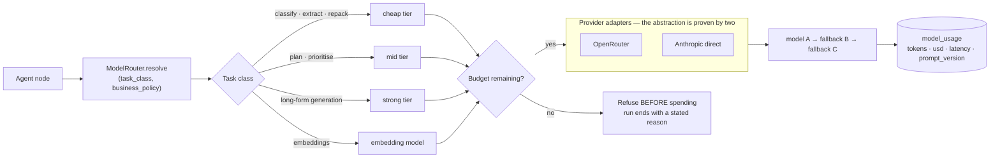

**What to notice:** the guard sits *before* the provider call, not after. Checking
cost once the tokens are spent is accounting, not control.

---

## 8. Approval and publishing — the actuator sequence

```mermaid
sequenceDiagram
    autonumber
    participant U as Owner
    participant A as FastAPI
    participant S as Actuator service
    participant D as Postgres
    participant X as CMS / social / email

    U->>A: POST /api/v1/content/{id}/approve
    A->>D: record approval + mint approval token
    A->>S: resume graph → EXPORT

    S->>D: resolve policy(business, action_type)
    alt policy needs approval and token missing or invalid
        S-->>A: refused_needs_approval
    end

    S->>D: SELECT WHERE idempotency_key = business:workflow:task:action
    alt already succeeded
        S-->>A: replayed — returns the FIRST result, no second publish
    end

    S->>D: INSERT actions(status=in_flight)
    Note over S,D: insert BEFORE the call — the unique index is the lock
    S->>X: publish (timeout, bounded retry)
    X-->>S: external_ref

    S->>D: UPDATE actions(status=succeeded, external_ref)
    S->>D: INSERT audit_log
    S-->>A: executed
    A-->>U: published + link

    Note over S,X: crash between the call and the update leaves in_flight;<br/>the reconciler ASKS the provider what happened,<br/>it never blind-retries
```

**What to notice:** the ordering is the design. Insert-then-call means an
interrupted publish is *detectable*; call-then-insert would make it invisible, and
the retry would double-publish.

---

## 9. Lead capture and attribution

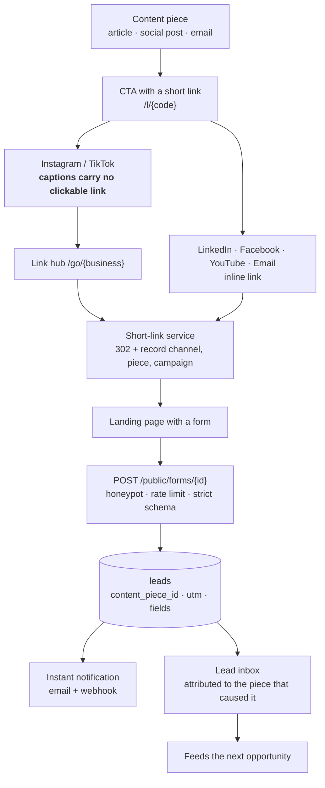

**What to notice:** the short-link service is ours, so attribution works even on
channels we cannot publish to. **Attribution is decoupled from publishing** — that
is what makes an export-only channel a fully measurable one.

---

## 10. One message spine, many channel renderings

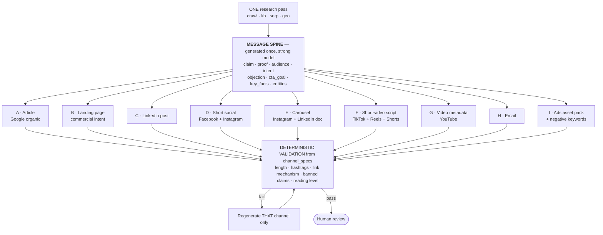

**What to notice:** nine artifacts, one decision about what is being said. F is a
single renderer serving three platforms — rewriting per platform would let the
model re-decide the point each time, which is how brand voice drifts.

---

## 11. Data model

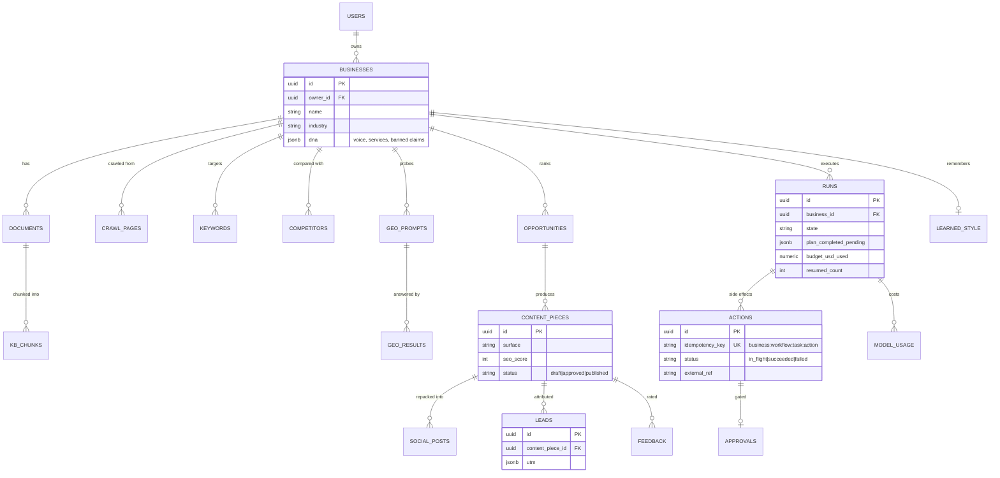

**What to notice:** every business-scoped table carries `business_id`, and
`actions.idempotency_key` is unique-indexed — the isolation guarantee and the
no-double-publish guarantee are both *schema* properties, not code conventions.

---

## 12. Deployment

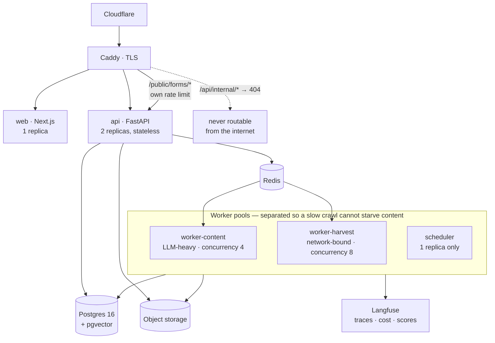

**What to notice:** `scheduler` is deliberately a single replica — its jobs are
not concurrency-safe. And the internal endpoints are 404'd at the edge, so the
token is defence *in depth*, not the only defence.

---

## 13. Degradation — what happens when something fails

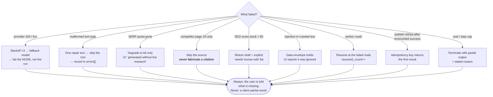

**What to notice:** every branch converges on the same rule. Degrading is fine;
degrading *quietly* is not.

---

## 14. Multi-agent topology — Track B, only when justified

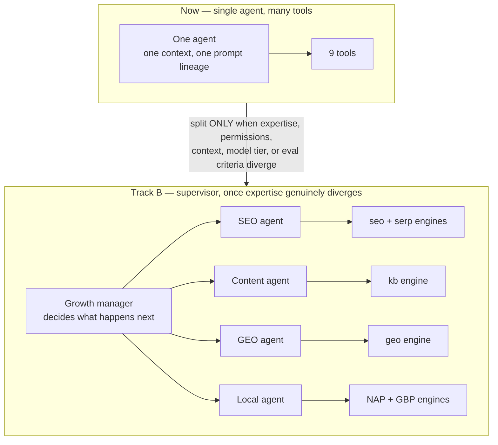

**What to notice:** the split condition is written down so it becomes a decision
rather than a fashion. Twenty-five agents talking to each other is not an
architecture, it is a debugging problem.
